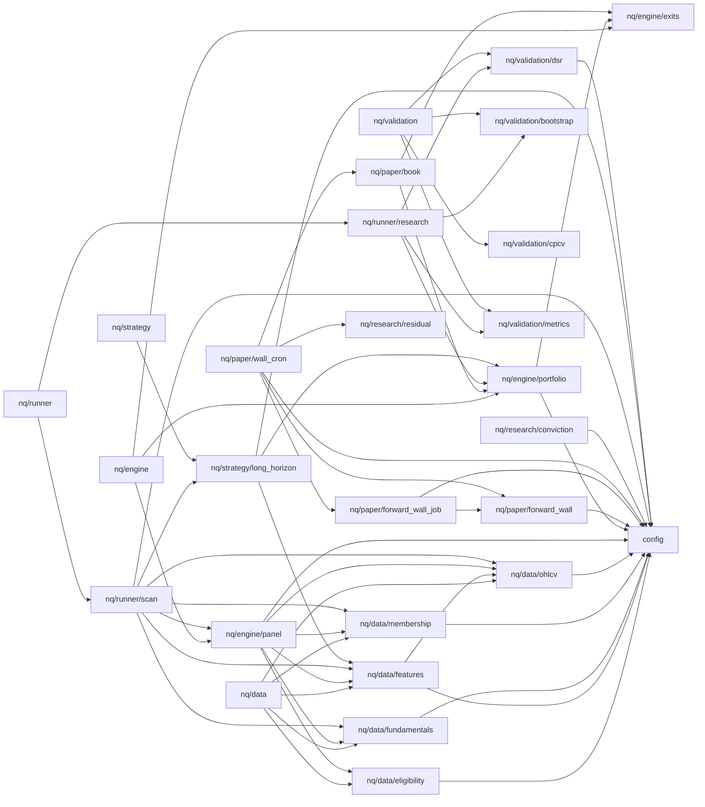

# nq dependency map

First-party module wiring of the `nq/` package (+ root `config.py`).
Granularity: **file-module**. Edges point from importer to imported.

_Auto-generated — do not edit by hand._
regenerate with: `python scripts/gen_depgraph.py`

