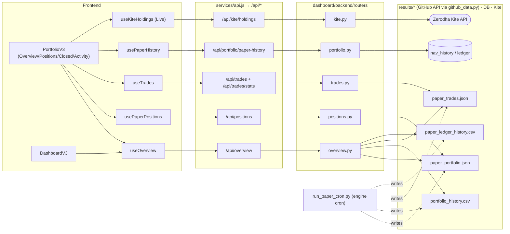
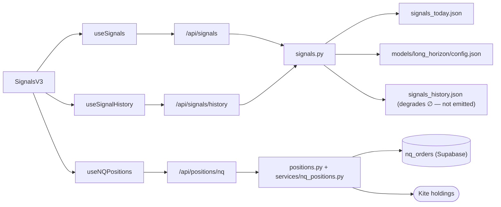

# Frontend Dependency & Wiring Map — niftyquant dashboard

> The frontend's **data wiring**: which page reads which React-Query hook, which hook calls which
> `services/api.js` function → `/api/*` endpoint, which backend router serves it, and which
> `results/*` file (written by the nifty-satvik paper cron) or DB table / Kite API it ultimately reads.
> Import-graph tools (trailmark) can't derive the runtime API/data flow, so this is authored from the
> code and kept current by hand. Engine-side map: [DEPENDENCY_MAP.md](DEPENDENCY_MAP.md) (the `nq/` graph).
>
> Layers: `frontend/src/pages/*` → `frontend/src/hooks/queries/*` → `frontend/src/services/api.js`
> → `dashboard/backend/routers/*` → `dashboard/backend/github_data.py` → `results/*` (via GitHub API) /
> Supabase / Kite. `run_paper_cron.py` (engine) writes the `results/*` files the read path consumes.

## 1. Paper data flow (Portfolio / Dashboard)



## 2. Signals data flow



## 3. Hook → endpoint → router → source (lookup table)

| Hook (`hooks/queries/`) | `api.js` fn | Endpoint | Router | Reads |
|---|---|---|---|---|
| `useOverview` | `fetchOverview` | `GET /api/overview` | `overview.py` | paper_portfolio.json, portfolio_history.csv, paper_trades.json, paper_ledger_history.csv |
| `usePaperPositions` | `fetchPositions` | `GET /api/positions` | `positions.py` | paper_portfolio.json |
| `useNQPositions` | `fetchNQPositions` | `GET /api/positions/nq` | `positions.py` + `services/nq_positions.py` | signals_history.json (∅) + `nq_orders` DB + Kite |
| `useTrades` | `fetchTrades` | `GET /api/trades` | `trades.py` | paper_trades.json |
| `useTradeStats` | `fetchTradeStats` | `GET /api/trades/stats` | `trades.py` | paper_trades.json |
| `useSignals` | `fetchSignals` | `GET /api/signals` | `signals.py` | signals_today.json, paper_portfolio.json, models/long_horizon/config.json |
| `useSignalHistory` | `fetchSignalHistory` | `GET /api/signals/history` | `signals.py` | signals_today.json, signals_history.json (∅), signal_analytics.json (∅) |
| `useNavHistory` | `fetchNavHistory` | `GET /api/portfolio/nav-history` | `portfolio.py` | `nav_history` DB (per-user) |
| `usePaperHistory` | `fetchPaperHistory` | `GET /api/portfolio/paper-history` | `portfolio.py` | paper_ledger_history.csv |
| `useKiteHoldings` / `useKiteMargins` / `useKiteState` | `kiteJson(...)` | `GET /api/kite/*` | `kite.py` | Zerodha Kite API (per-user session) |
| `useNQOrders` | `fetchNQOrders` | `GET /api/nq-orders` | `nq_orders.py` | `nq_orders` DB |
| `useOverview().metrics` (landing) | — | `GET /api/landing-stats` | `landing_stats.py` | trade_log.csv (∅), production_strategy.json (∅), portfolio_history.csv |
| `useBacktest*` | `fetchBacktest*` | `GET /api/backtest/*` | `backtest.py` | signals_history.json (∅), backtest_data.json (∅) |

`∅` = nifty-satvik's cron does **not** emit this file; the router degrades to an empty state (`or []`/`{}`).

## 4. Per-page wiring tree (every routed page)

Routes from `App.js` (all under `ProtectedAppLayout`). Legend: ✅ live now (paper-cron data) ·
⏳ fills as the book runs / trades close · 🔌 needs a Kite session · 🗄 needs DB rows (`nq_orders`) ·
∅ backend reads a file nifty-satvik doesn't emit → empty state.

```
/dashboard · DashboardV3
├─ RegimeStrip     → useSignals().regime + useIndexSparklines()                 → /api/signals            ✅(regime UNKNOWN until wired)
├─ TrendingCards   → useSignals().signals (top 3)                               → /api/signals→signals_today.json  ✅
├─ SectorBreadth   → useSignals().signals grouped by sector                     → /api/signals            ✅
├─ StocksTable     → useKiteHoldings() + useQuoteBatch()                        → /api/kite/holdings      🔌
└─ BalanceCard     → useKiteMargins() + useOverview().portfolio                 → /api/kite/margins 🔌 + /api/overview ✅

/premove · SignalsV3   (the "Signals" nav item)
├─ Signal cards    → useSignals() (signals + regime + cron_health + sizing)     → /api/signals→signals_today.json  ✅
├─ Watchlist tier  → useWatchlist()                                             → /api/signals/watchlist→signals_watchlist.json  ∅
├─ Held detection  → useKiteHoldings() 🔌 + useNQPositions()                    → /api/positions/nq  🗄
└─ Order pad sizing→ useKiteMargins()                                           → /api/kite/margins       🔌

/portfolio · PortfolioV3   (tabbed — the one we've been building)
├─ Overview tab
│   ├─ EquityHero      → useOverview() + useNavHistory()/usePaperHistory()      → /api/overview ✅ + /api/portfolio/paper-history
│   ├─ Perf/Risk ribbons→ useOverview().metrics                                 → /api/overview→paper_trades.json + paper_ledger_history.csv  ✅
│   └─ AllocCard        → useOverview()/usePaperPositions()                     → /api/positions→paper_portfolio.json  ✅
├─ Positions tab       → usePaperPositions() (paper) | useKiteHoldings() (live) → /api/positions→paper_portfolio.json  ✅
├─ Closed Trades tab   → useTrades() + RealizedStrip + MonthlyPnl              → /api/trades→paper_trades.json  ⏳(0 until an exit)
└─ Activity tab        → usePaperPositions() + useTrades()                      → /api/positions + /api/trades  ✅/⏳

/orders · OrdersV2         → useKiteOrders()                                    → /api/kite/orders        🔌
/funds · FundsV2           → useRawMargins()                                    → /api/kite/margins       🔌
/pnl · AnalyticsV2         → useOverview() + useTradeStats() + useTrades(200)   → /api/overview ✅ + /api/trades/stats→paper_trades.json  ⏳
/journal · JournalV2       → useNQOrders()                                      → /api/nq-orders          🗄
/accounting · AccountingV2 → useNQOrders() (brokerage/STT)                      → /api/nq-orders          🗄
/track-record · TrackRecordV2 → useBacktestLive() + useBacktestHistorical()     → /api/backtest/live+historical→backtest_data.json  ∅
/backtest · BacktestV2     → useBacktestLive/Historical (+ /api/backtest/run stub) → /api/backtest/*→backtest_data.json  ∅
/stock/:symbol · StockDetailV2 → useSignalHistory()                            → /api/signals/history→signals_history.json  ∅
/settings · SettingsV2     → AuthContext(/api/auth/me) + fetchMfaStatus() + KiteContext  → /api/auth/* + /api/kite/session/status  ✅
/admin · AdminV2           → useSignals() + admin endpoints                     → /api/signals ✅ + /api/admin/*
```

**Populated today (from the paper cron):** Portfolio (Overview + Positions), Signals cards, Dashboard trending/regime, Analytics KPIs. **Waiting on a Kite session (🔌):** Dashboard holdings/balance, Orders, Funds. **Waiting on DB rows (🗄):** Journal, Accounting (populate when orders are placed via the Buy/Sell UI). **Empty by design (∅):** Track-record / Backtest / Watchlist / StockDetail history — nifty-satvik's cron doesn't emit `backtest_data.json` / `signals_history.json` / `signals_watchlist.json` (a Stage-F/analytics data task if you want them live).

## 5. Cross-cutting infrastructure
- **`services/api.js`** — all fetches go through `authJson`/`authPost` (adds JWT, auto-refreshes on 401 via
  `/api/auth/refresh`) or `kiteJson`/`kitePost` (Kite-session-expiry detection). Never bypass these wrappers.
- **`context/AuthContext.jsx`** — holds `user`; `App.js::ProtectedAppLayout` redirects to `/login` when `!user`.
- **`context/KiteContext`** — Kite connection state (`connected`), provided by `ProtectedAppLayout`.
- **React Query** (`lib/queryClient.js`) — caches responses (15 min trades, 30 s positions); NOT persisted to
  localStorage, so a full reload refetches.
- **`github_data.py`** — the read layer: results/* are GitHub-first (30 s cache, `GITHUB_TOKEN`) from
  `kreeshpatel/nifty-satvik@main`, then local. models/* are local-first. **Requires `GITHUB_TOKEN`** on Fly.
- **Deploy:** frontend → Vercel (Root Directory `frontend`); backend → Fly (`nifty-satvik-api`, builds
  `deploy/Dockerfile`). See [STAGE_E_DASHBOARD_DEPLOY.md](STAGE_E_DASHBOARD_DEPLOY.md).

## 6. Maintenance
Update this map when you: add/rename a query hook or `api.js` fetch fn, add/rename an `/api/*` endpoint or
router, or change which `results/*` file a router reads. It is the frontend counterpart to
[DEPENDENCY_MAP.md](DEPENDENCY_MAP.md); keep both current (owner memory: regenerate the engine dep-map after
`nq/**` changes; update this by hand after frontend/backend wiring changes).
